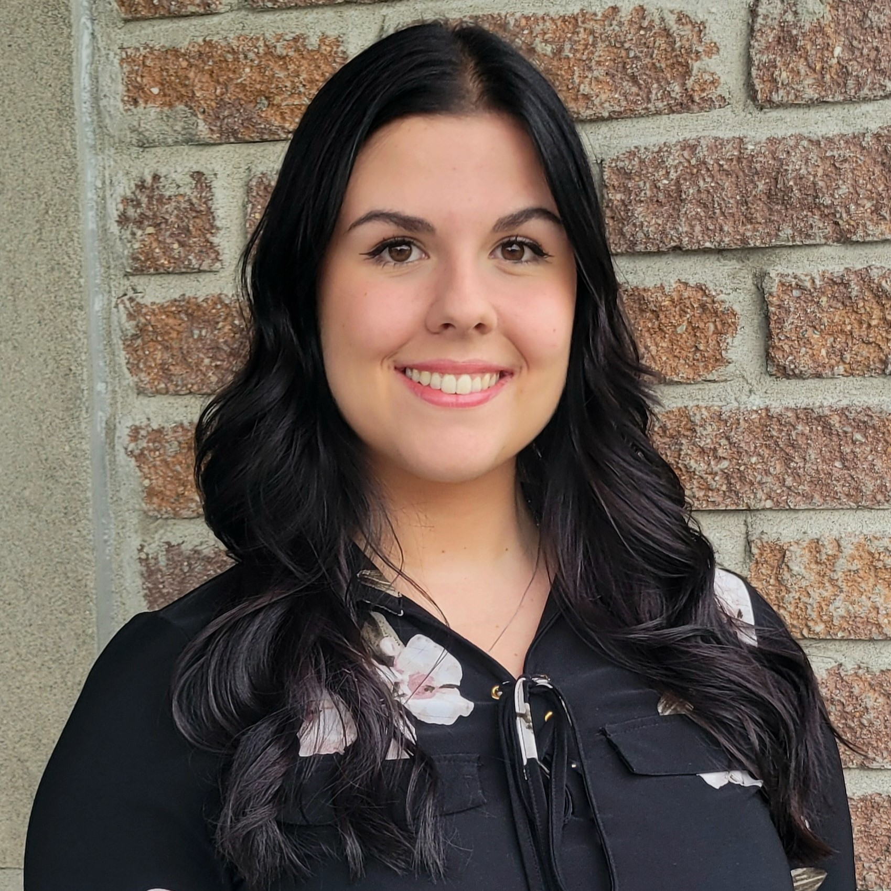

## Introduction

{align="right": style="height:250;width:250px"}

I've always been passionate about the Universe and the fact that it's still widely unknown, which inspired me to pursue a career in studying it. I completed my Bachelor's degree in Physics with a concentration in Astrophysics at Université de Montréal (UdeM), where I first began my journey in astrophysics research at the Trottier Insitute for Research on Exoplanets ([IREx](https://exoplanetes.umontreal.ca/en/)). I remained affiliated with IREx and supervised by Prof. David Lafrenière throughout my Master's degree at UdeM, where I studied the atmosphere of exoplanets, i.e., planets outside the Solar System, using data from the James Webb Sapce Telescope (JWST).

After studying other worlds within our own galaxy, I am now expanding my research to the entire cosmos. I'm pursuing my doctoral studies at McGill University in Prof. Adrian Liu's research group. My project focuses on observational 21 cm cosmology, which traces the distribution of matter in the Universe. The goal is to create a 3D map of this matter, providing insights into the evolution of the Universe since looking far away in space is akin to looking back in time. Ultimately, it will help constrain key aspects of the Universe's expansion, galaxy formation, dark matter, and fundamental physics, including General Relativity.

Beyond academia, I'm actively involved in scientific outreach events, as I'm committed to making research accessible to the public and demystifying the work done in my field. I also aim to show how one can transition from a passion for science to a dedicated career in research. Additionally, I work with young students as a teaching assistant and hold a [key position](../implication/index.md) in the organization [InitiaSciences](https://initiasciences.ca/).

## Other Interests

Outside of academia, here are a few of my passions:

- [Pandas](./pandas.md)
- [Reading](./reading.md)

## CV

<!-- How to embed a PDF -->
<iframe width="100%" height="600" src="./media/KIM MOREL_CV_academic_website.pdf">