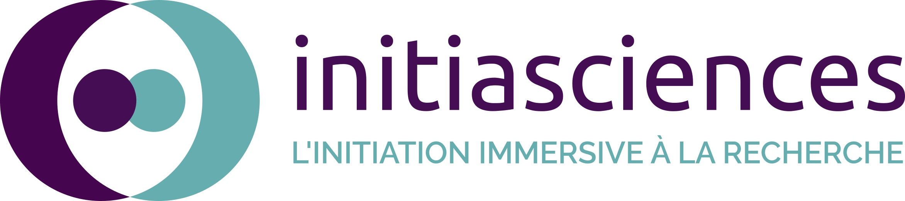

# Outreach and Community

I like to get involved in anything related to scientific outreach and science accessibility.

{align="right": style="width:300px"}

- I am treasurer for [InitiaSciences](https://initiasciences.ca/). InitiaSciences is a mentoring program for CEGEP and high school students in Quebec. Young students can participate in cutting-edge scientific research projects by being mentored by gradaute students from any science field.

{align="bottom": style="width:500px"}

- I regularly volunteer for outreach events at my University targeted to the public or young students. I also participated twice in the Researchers’ Night by Espace pour la vie. In 2024, I gave a talk about the access to Physics graduate studies at the Symposium Annuel de Physique (et Mathématiques) pour un Avenir en Recherche et en Industrie (SAPHARI) of Université de Montréal to give undergraduate students the information they needed to pursue graduate studies in Physics.

Here's a picture of me and other colleagues from Université de Montréal during [AstroMIL 2023](https://exoplanetes.umontreal.ca/en/event/astromil-2023-an-astronomy-celebration-for-all/).
{align="bottom": style="width:500px"}
