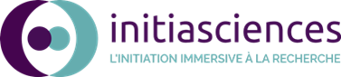
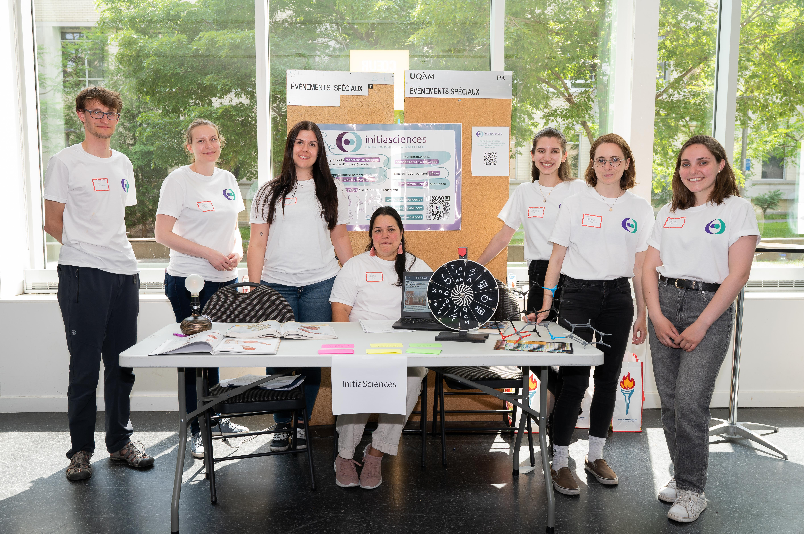
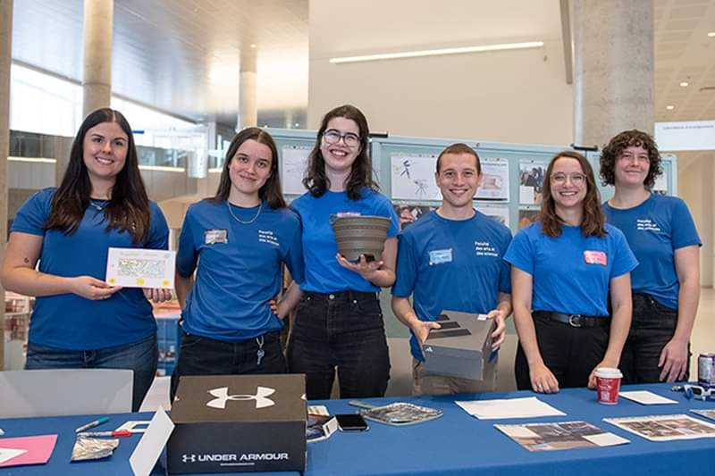

# Outreach and Community

I like to get involved in anything related to scientific outreach and science accessibility.

{align="right": style="width:300px"}
- I am treasurer for [InitiaSciences](https://initiasciences.ca/). InitiaSciences is a mentoring program for CEGEP and high school students in Quebec. Young students can participate in cutting-edge scientific research projects by being mentored by gradaute students from any science field.

{align="bottom": style="width:500px"}

- I regularly volunteer for outreach events:
    - Grande Conférence de l’IREx 2024, *Université de Montréal*, Volunteer.
    - Symposium Annuel de Physique (et Mathématiques) pour un Avenir en Recherche et en Industrie (SAPHARI) 2024, *Université de Montréal*, Speaker.
    - Canadian Conference for Undergraduate Women in Physics (CCUWiP) 2024, *Université de Montréal*, Volunteer.
    - Researchers’ Night 2022 & 2023, *Espace pour la vie, Biosphère*, Student-Researcher.
    - AstroMIL 2023, *Université de Montréal*, Volunteer.

{align="bottom": style="width:500px"}

- I participated in ComSciCon-Qc 2023.