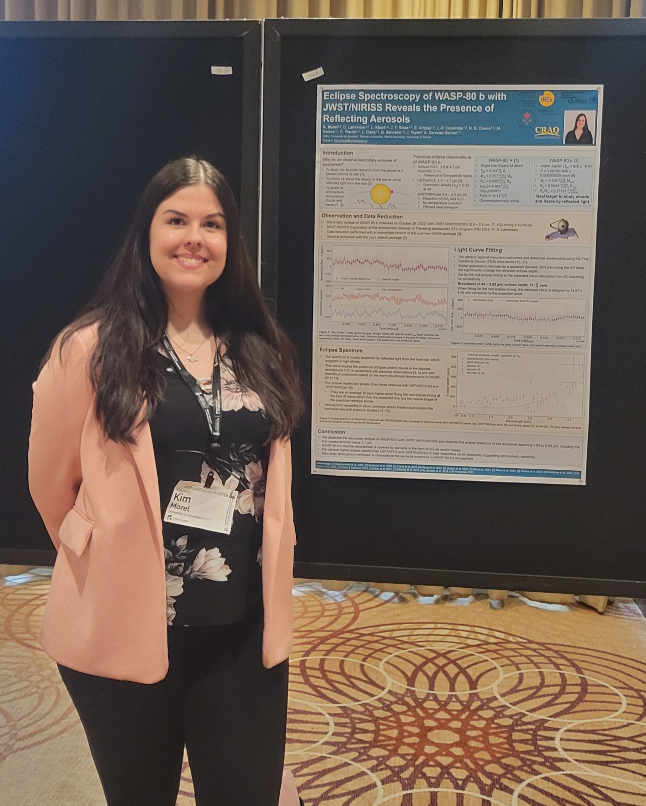

# Publications

## 2024
- A Moderate Albedo from Reflecting Aerosols on the Dayside of WASP-80 b Revealed by JWST/NIRISS Eclipse Spectroscopy. Morel et al., Submitted on 2024/09/26
- [Near-Infrared Transmission Spectroscopy of HAT-P-18 b with NIRISS: Disentangling Planetary and Stellar Features in the Era of JWST. Fournier-Tondreau et al. (incl. K. Morel), Monthly Notices of the Royal Astronomical Society. 528: 3354–3377, 2024]([https://academic.oup.com/mnras/article/528/2/3354/7468143])
## 2023
- [The Near Infrared Imager and Slitless Spectrograph for the James Webb Space Telescope. III. Single Object Slitless Spectroscopy. Albert et al. (incl. K. Morel), Publications of the Astronomical Society of the Pacific. 135:075001 2023 ]([https://iopscience.iop.org/article/10.1088/1538-3873/acd7a3])

# Posters

{align="right": style="height:300;width:300px"}
- Eclipse Spectroscopy of WASP-80 b with JWST/NIRISS Reveals the Presence of Reflecting Aerosols. The annual meeting of the Canadian Astronomical Society: CASCA-TO 2024.