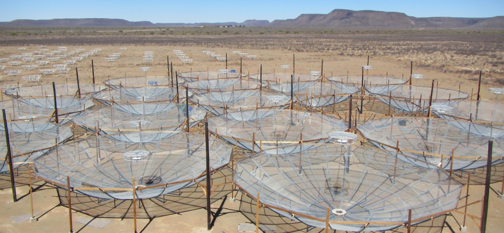
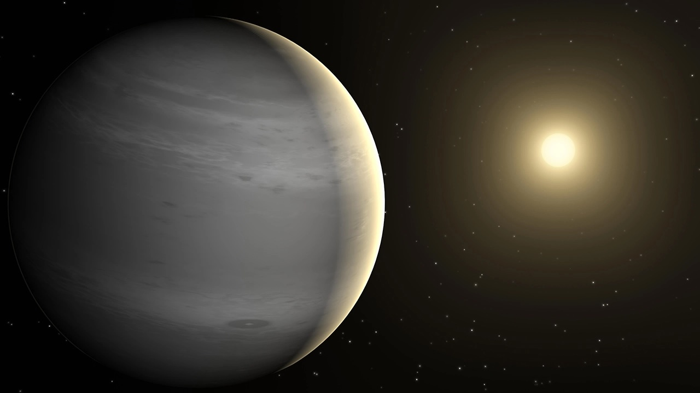

# Research Interests

## Current Research

I am mostly interested in observational 21 cm cosmology, a field named after the 21 cm wavelength at which hydrogen — the simplest element in the Universe — emits photons, i.e., light. These photons are detectable by radio telescopes, such as the Hydrogen Epoch of Reionization Array (HERA[@deboer_hydrogen_2017]), which provides the data I utilize to work on a new method for foreground removal. Foreground contaminants pose a significant challenge in 21 cm cosmology because they are much brighter than the cosmological 21 cm signal. Therefore, an accurate subtraction of these foregrounds is crucial to successfully detect the cosmological signal.

{align="top": style="width:750px"}

Credits: [HERA](https://reionization.org/).

## Past Research

During my Master's degree, I was part of the Trottier Institute for Research on Exoplanets at the Université de Montréal. I studied the atmospheres of exoplanets using data from the Near-InfraRed Imager and Slitless Spectrogrpah (NIRISS[@doyon_near_2023]) on board the James Webb Space Telescope (JWST). In particular, I studied the atmosphere of the warm Jupiter WASP-80 b using secondary eclipse data.
Secondary eclipses happen when an exoplanet passes behind its star during its orbit, leading to a slight brightness decrease in the total flux we receive from the system as the star momentarily blocks the light coming from the orbiting planet. They allow us to study the planet’s thermal emission and the starlight it reflects.
For WASP-80 b, we’ve discovered that some of the star’s light is being reflected because we can see a glow at certain wavelengths where the planet itself doesn’t give off much heat. This suggests the presence of aerosols, i.e., clouds or hazes, as they are responsible for this reflection. We've also constrained the albedo of the planet, i.e. the fraction of reflected light, to better precision than ever before.

Warm and hot jupiters are interesting objects, as they do not exist in the Solar System. By characterizing their atmosphere, we can obtain information about their formation and evolution.

Our paper on this research was recently submitted!

{align="top": style="width:750px"}

Artist's representation of WASP-80 b. Credits: [NASA](https://science.nasa.gov/exoplanet-catalog/wasp-80-b/).

A full list of publications can be found [here](./all_publications.md).